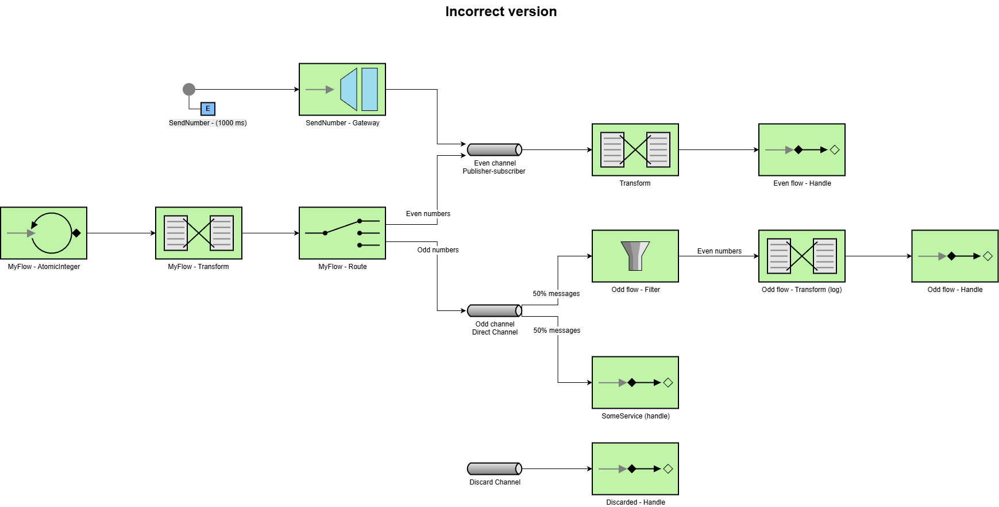

# Lab 5 Integration and SOA - Project Report

## 1. EIP Diagram (Before)

Describe what the starter code does and what problems you noticed.

El codigo inicial incluye un generador atomico de numeros enteros y, dependiendo de si son pares o impares, un patron
`route` los separa en el canal publicador suscriptor `evenChannel` y el canal directo `oddChannel` respectivamente.

Desde el canal `evenChannel` se pasa por un transform y un handle que simplemente los muestra por el log. A este canal,
además de llegarle la entrada desde el route, le llegan tambien numeros aleatorios negativos generados periodicamente
por el `sendNumber`.

Por otro lado, al canal directo `oddChannel` llegan los numeros impares generados atomicamente. Sin embargo, a su salida
se implementa un filtro que permite el paso unicamente de numeros pares, por lo que no se obtendrá nada de esta salida.
Además, un servicio `SomeService` lee tambien de la salida del canal `oddChannel`, haciendo que la salida del canal se
reparta de forma equivalente entre ambos flujos, y los devuelve en el log.

Por ultimo, existe un canal `DiscardChannel` aislado con un handle que imprime su salida en el log.

Diagrama EIP de la version incorrecta

---

## 2. What Was Wrong

Explain the bugs you found in the starter code:

**Bug 1**: What was the problem? Why did it happen? How did you fix it?
- El primer error encontrado ha sido que en el log, las salidas correspondientes al Odd Handler no aparecen.
- Esto ocurre porque al filtro de `oddFlow` solo llegan numeros impares y este solo permite el paso de los pares, por lo que no habra salida.
- Para solucionarlo, como nos fiamos de quien puede escribir en el canal, podemos eliminar el filtro completamente. Si no nos fiaramos de las escrituras, seria mejor invertir el filtro para permitir el paso de los valores impares.
  
**Bug 2**: What was the second problem? Why did it happen? How did you fix it?
- El segundo problema es que la salida del log correspondiene al Service Activator solo muestra la mitad de los numeros impartes que deberia, saltandose uno de cada dos.
- Esto se debe a que el canal oddChannel es un canal directo y no publicacion suscripcion. Al ser un canal directo pero tener dos elementos leyendo su salida, cada salida leida por un elemento la pierde el otro.
- Hay que convertir el canal en un publicador suscriptor para que lleguen todos los numeros a ambos elementos
  
**Bug 3**: What was the third problem? Why did it happen? How did you fix it?
- El tercer problema es que en la salida de Even Handler se muestran algunos numeros negativos (pares e impares) cuando solo deberian aparecer los numeros impares.
- Este error se debe al SendNumber que escribe numeros aleatorios negativos en el canal `evenChannel`.
- Para solucionarlo, este servicio `SendNumber` debe conectarse a una cola auxiliar, antes de ejecutar el route que divida la entrada segun la paridad.

---

## 3. What You Learned

Write a few sentences about:

- What you learned about Enterprise Integration Patterns
- How Spring Integration works
- What was challenging and how you solved it

---

## 4. AI Disclosure

**Did you use AI tools?** (ChatGPT, Copilot, Claude, etc.)

- If YES: Which tools? What did they help with? What did you do yourself?
- If NO: Write "No AI tools were used."

**Important**: Explain your own understanding of the code and patterns, even if AI helped you write it.

---

## Additional Notes

Any other comments or observations about the assignment.
